# BIA AWS Lab Environment

> Infraestrutura AWS para a aplicação BIA 2026 — gerenciador de tarefas containerizado, provisionado com Terraform.

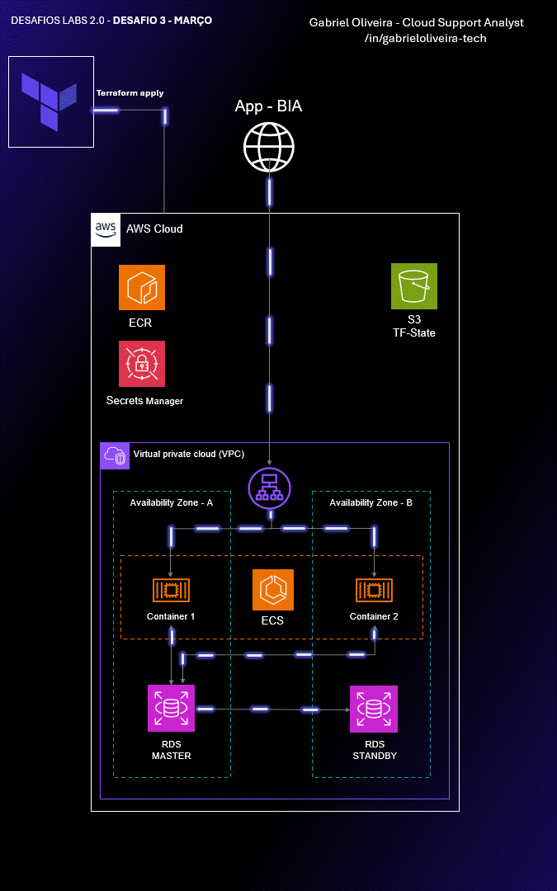

## Visão Geral

O **BIA 2026** é um gerenciador de tarefas com frontend web e backend containerizado. Toda a infraestrutura é provisionada na AWS via Terraform, utilizando ECS (EC2 launch type) para rodar os containers, RDS PostgreSQL como banco de dados, ALB para distribuição de carga entre duas zonas de disponibilidade e Secrets Manager para gerenciamento seguro de credenciais.

## Diagrama de Arquitetura

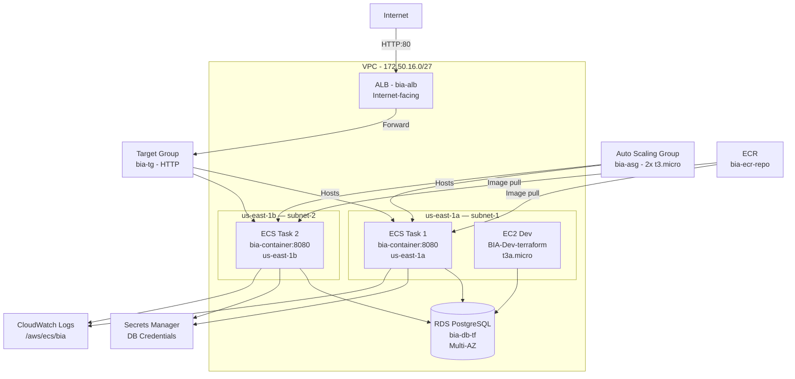

## Pré-requisitos

- Terraform >= 1.x
- AWS CLI configurado com profile
- Permissões de administrador na conta AWS

## Como Usar

```bash
# 1. Provisionar o backend S3 (apenas na primeira vez)
cd Comece-aqui
terraform init && terraform apply

# 2. Provisionar a infraestrutura principal
cd ..
terraform init
terraform plan
terraform apply
```

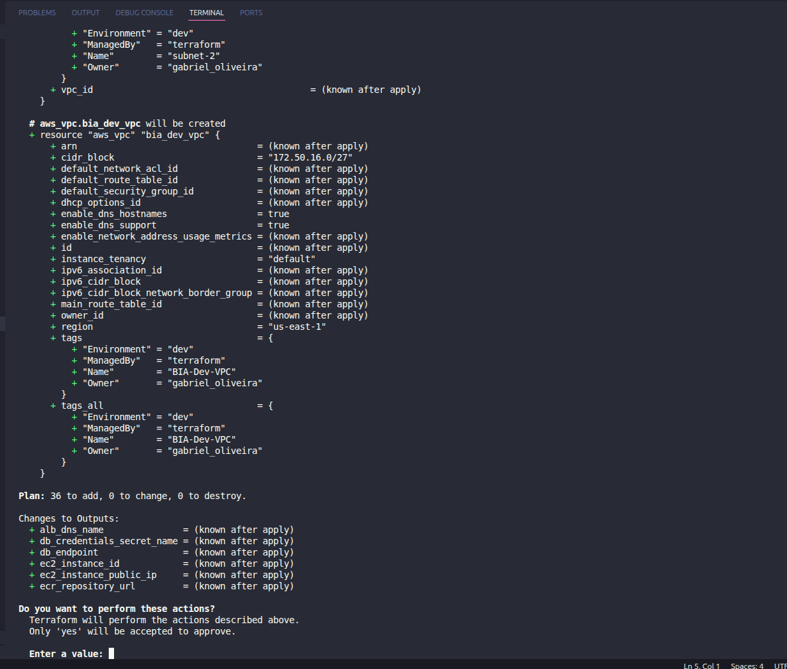

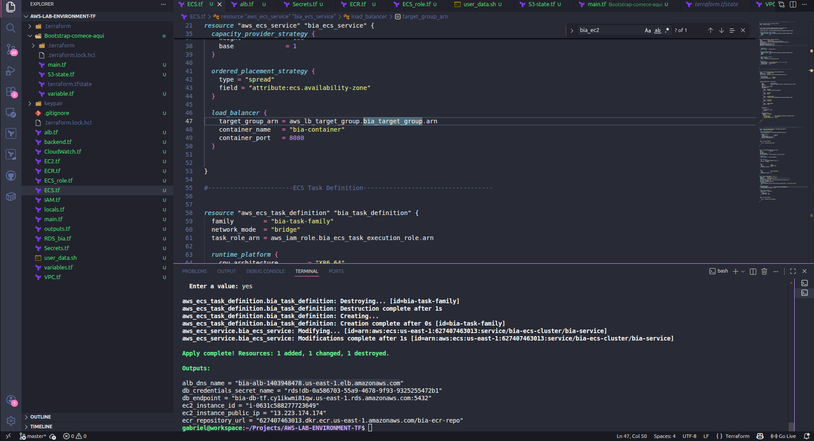

---

## Componentes

### Rede (VPC)

- VPC `BIA-Dev-VPC` com CIDR `172.50.16.0/27`
- 2 subnets públicas: `subnet-1` (us-east-1a) e `subnet-2` (us-east-1b)
- Internet Gateway + Route Table com rota `0.0.0.0/0`
- Security Groups: `bia-alb`, `bia-ec2`, `bia-dev`, `bia-web`, `bia-db`

---

### EC2 — Máquina de Desenvolvimento

- Instância `BIA-Dev-terraform` — `t3a.micro`, Amazon Linux 2023, volume gp3 20GB
- Usada para desenvolvimento, testes e acesso direto ao banco via SSM
- IAM Instance Profile com permissões de ECS agent, SSM e ECR

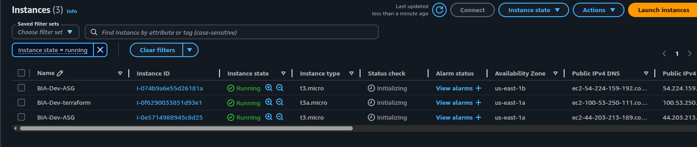

---

### ECS — Elastic Container Service

- Cluster `bia-ecs-cluster` com capacity provider EC2 (Auto Scaling)
- Serviço `bia-service`: 2 tasks desejadas, distribuídas por AZ (spread strategy)
- Task definition `bia-task-family`:
  - Container `bia-container` na porta 8080 (host port dinâmico)
  - 1024 CPU units, 400MB memória reservada
  - Imagem provinda do ECR (`bia-ecr-repo:latest`)
  - Variáveis de ambiente: `DB_HOST`, `DB_PORT`, `DB_SECRET_NAME`, `DB_REGION`
  - Logs enviados ao CloudWatch via `awslogs` driver

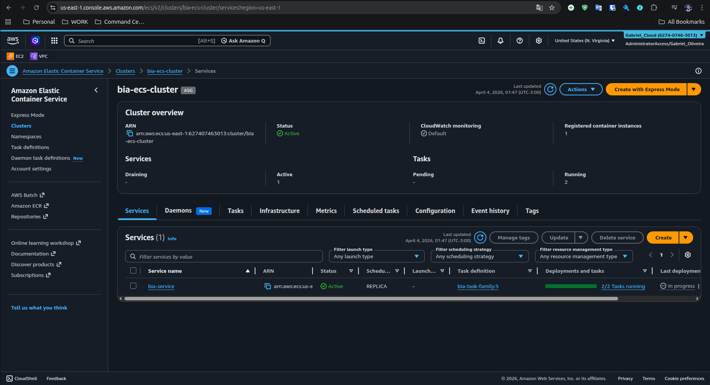

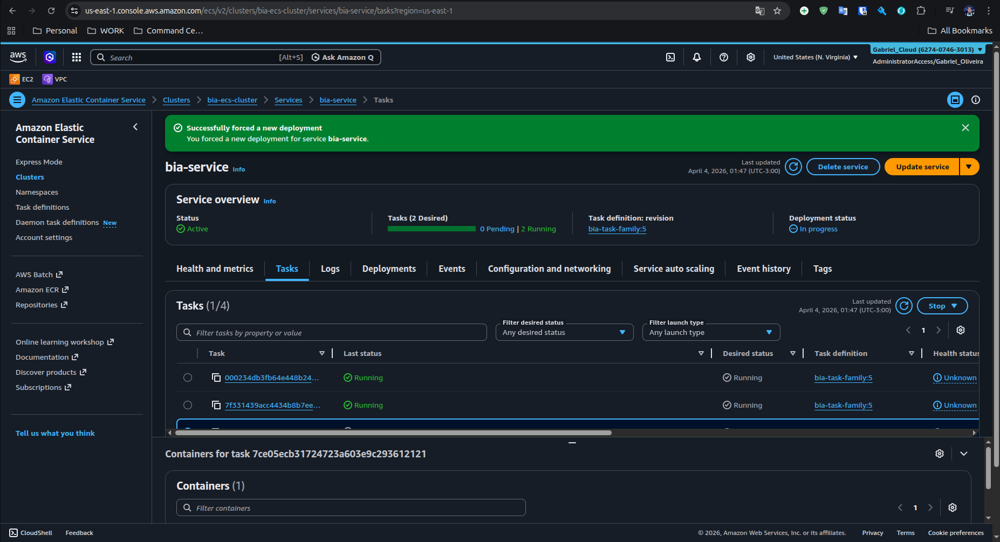

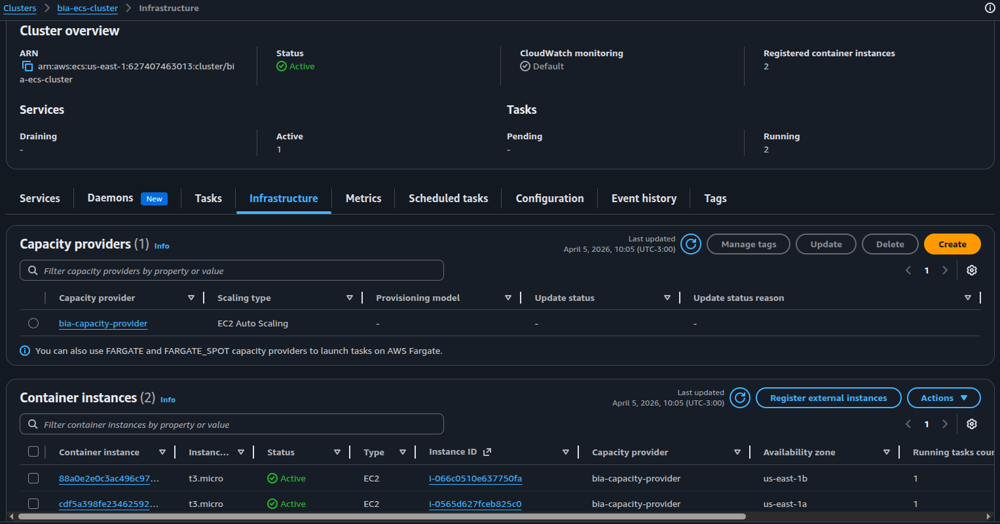

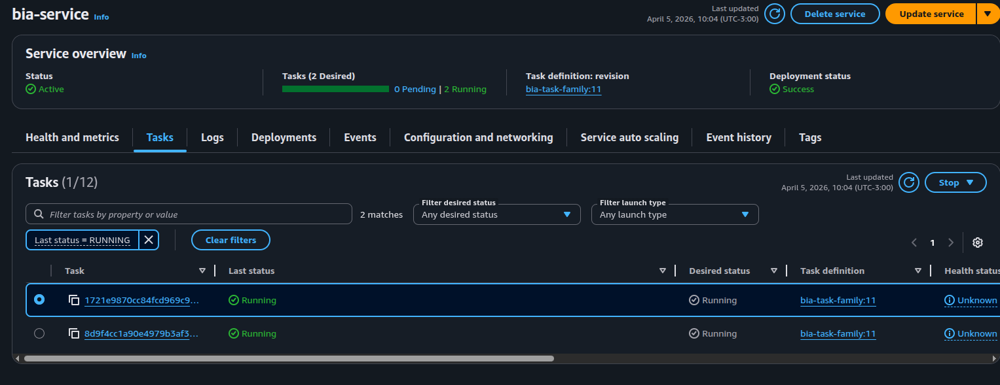

---

### Auto Scaling Group

- ASG `bia-asg`: min 2, max 2 instâncias `t3.micro`
- Launch template com AMI ECS-optimized obtida via SSM Parameter Store
- Capacity provider com managed scaling habilitado (target 100%)
- Instâncias registradas automaticamente no cluster ECS

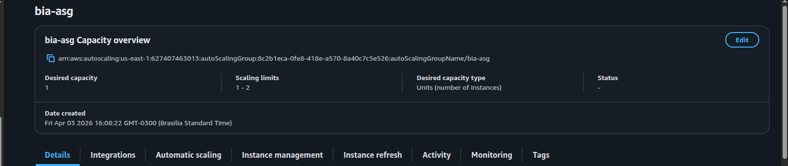

---

### Application Load Balancer (ALB)

- ALB `bia-alb`: internet-facing, HTTP:80, 2 Availability Zones
- Target group com health check em `GET /api/versao` (HTTP 200)
- 2 targets healthy — um container por instância EC2 do ASG

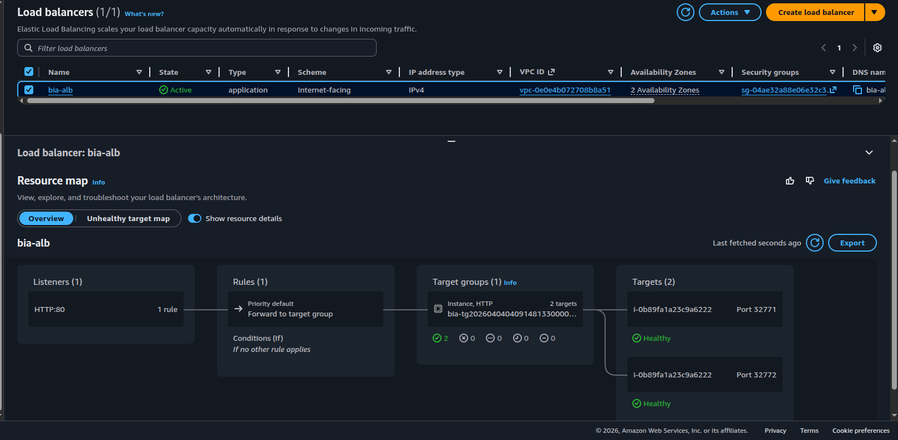

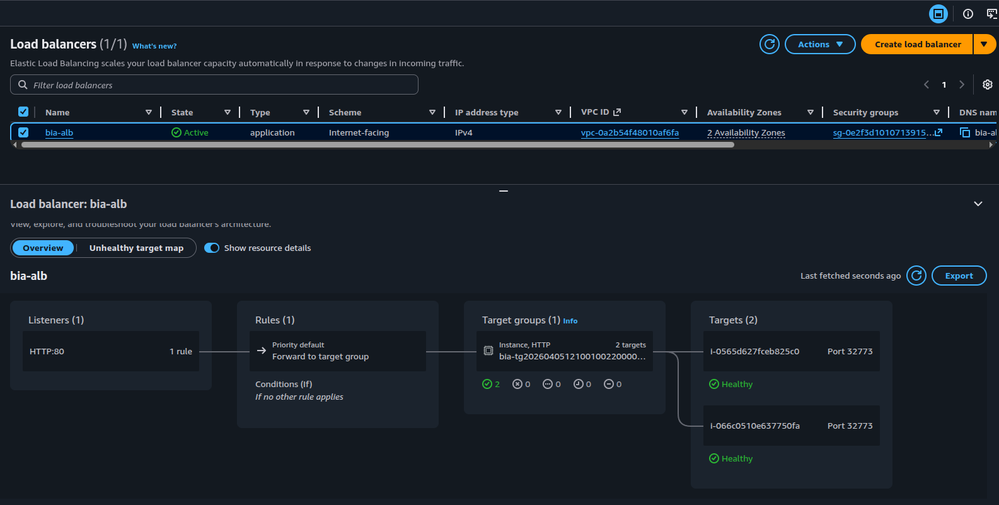

---

### RDS — Banco de Dados

- PostgreSQL 17.4, instância `db.m5.large`, Multi-AZ habilitado
- Banco `bia_db`, usuário `postgres`, 10GB alocado
- Credenciais gerenciadas automaticamente pelo Secrets Manager (`manage_master_user_password = true`)
- Subnet group abrangendo as 2 AZs

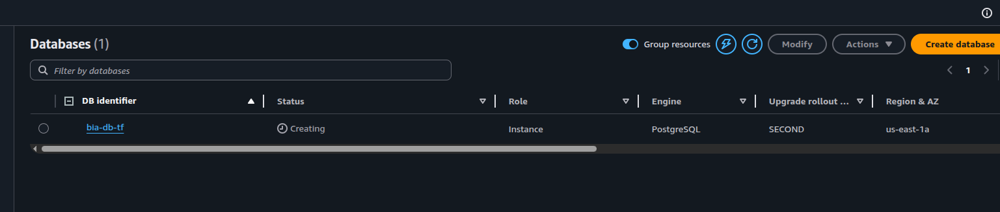

---

### ECR — Container Registry

- Repositório `bia-ecr-repo` para armazenar a imagem Docker da aplicação
- Tags mutáveis, `force_delete = true` para facilitar o teardown do lab

---

### Secrets Manager

- Secret criado automaticamente pelo RDS com as credenciais do banco
- ECS tasks acessam as credenciais via AWS SDK em runtime (sem expor senha em variáveis de ambiente)
- IAM policy `get-secret-value-policy` concede acesso apenas ao secret do RDS

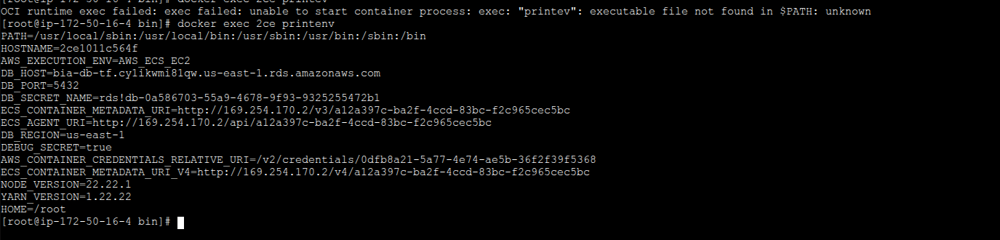

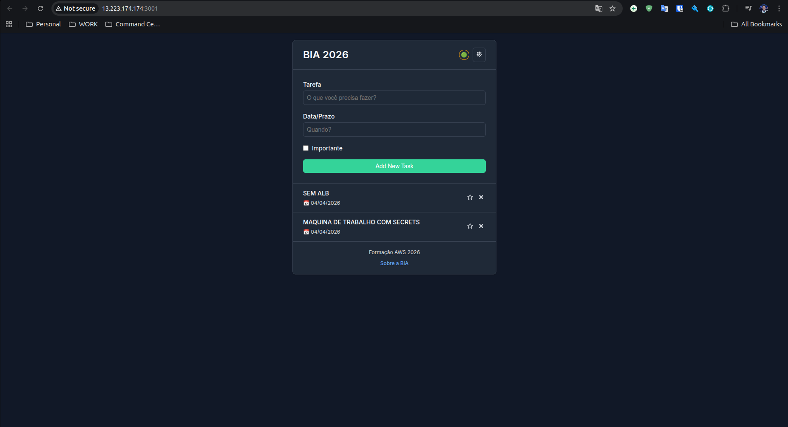

---

### CloudWatch Logs

- Log group `/aws/ecs/bia` com retenção de 7 dias
- Todos os containers do serviço `bia-service` enviam logs automaticamente

---

### IAM

- **`bia-dev-role`** (EC2): `AmazonEC2ContainerServiceforEC2Role` + `AmazonSSMManagedInstanceCore` + `AmazonEC2ContainerRegistryPowerUser`
- **`bia-ecs-task-execution-role`** (ECS Tasks): `AmazonECSTaskExecutionRolePolicy` + policy customizada para `secretsmanager:GetSecretValue`

---

## Aplicação em Funcionamento

Evolução do deploy — da EC2 direta até o ALB com ECS:

| Etapa | Screenshot |
|---|---|
| App rodando direto na EC2 (sem ALB) | 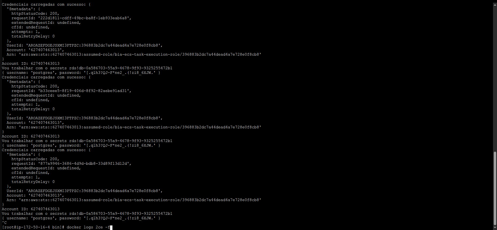 |
| App na EC2 porta 3001 com Secrets integrado | 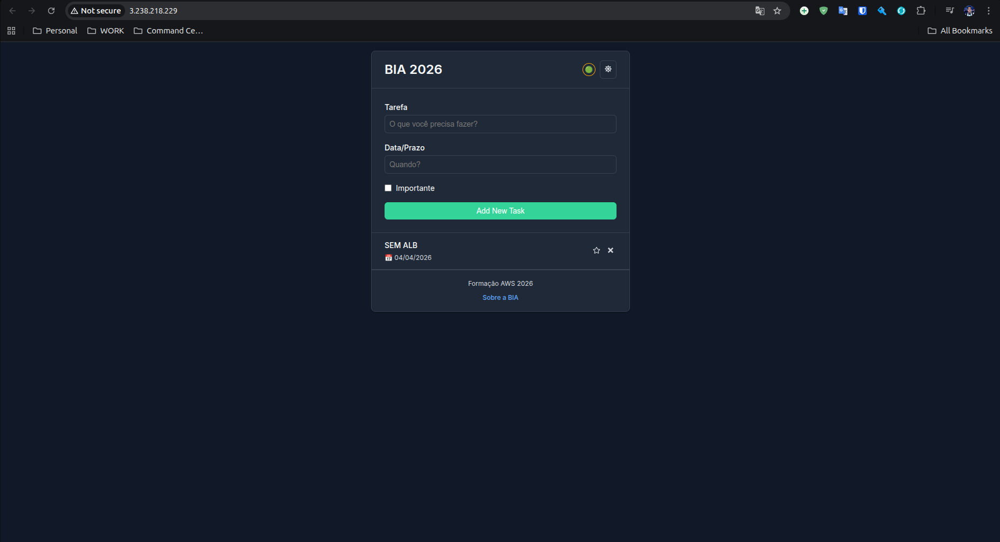 |
| App via DNS do ALB (estado final) | 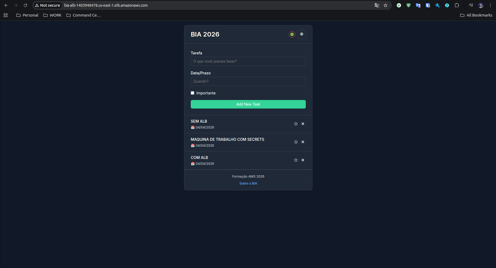 |

---

## Outputs

| Output | Descrição |
|---|---|
| `alb_dns_name` | DNS público do ALB |
| `ec2_instance_id` | ID da instância EC2 de desenvolvimento |
| `ec2_instance_public_ip` | IP público da EC2 |
| `db_endpoint` | Endpoint do RDS |
| `ecr_repository_url` | URL do repositório ECR |
| `db_credentials_secret_name` | Nome do secret no Secrets Manager |

---

## Tags Padrão

Todos os recursos são tagueados com:

```hcl
Environment = "dev"
ManagedBy   = "terraform"
Owner       = "gabriel_oliveira"
```
